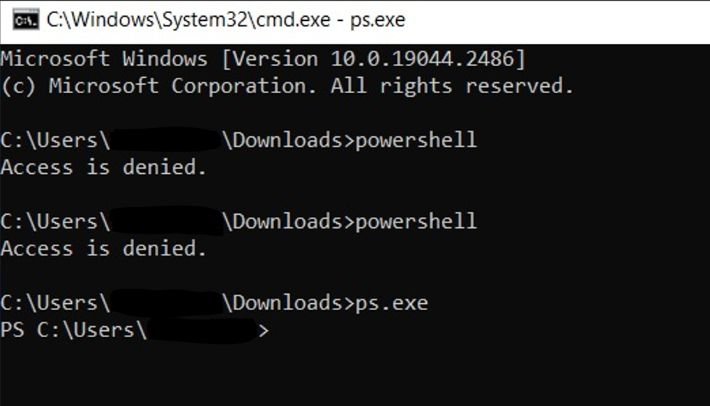
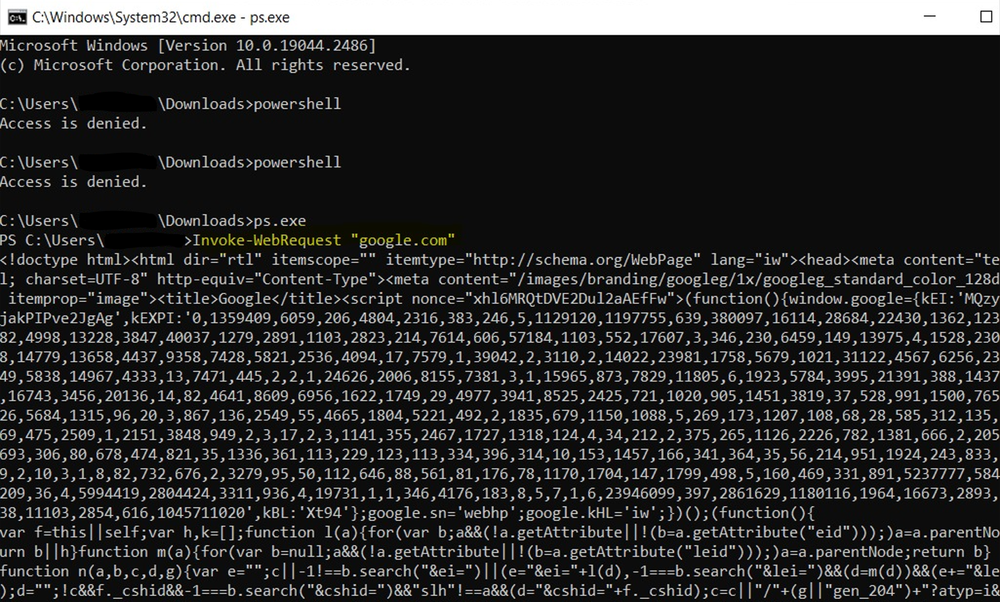

# Bypass-PS-Restrictions
This repo is about bypassing Powershell restrictions such as GPO, AV and EDR.

# Testing Environment
The file was tested on restrictions environments Windows endpoint and server with GPO restrictions, AV and EDR.

# Compiling the file:
In CMD copy and paste the following command:
C:\Windows\Microsoft.NET\Framework\v4.0.30319\csc.exe /reference:"C:\Windows\assembly\GAC_MSIL\System.Management.Automation\1.0.0.0__31bf3856ad364e35\System.Management.Automation.dll" /out:POC.exe "powershellBypass.cs"

# POC

